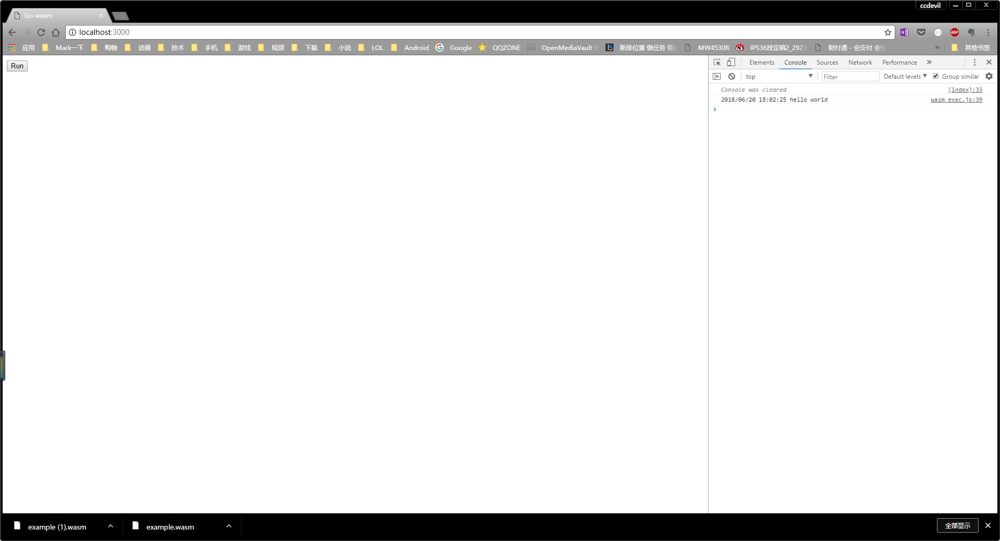

# LearnWasmWithGo
## 运行Hello World

### 1.拷贝github.com/golang/go/misc/wasm目录下wasm基本运行文件到项目目录下：
    wasm_exec.js
    wasm_exec.html

### 2.重命名wasm_exec.html为index.html
### 3.编写main.go文件
### 4.编译main.go文件
    go build -o example.wasm main.go
### 5.编写server.go文件
### 6.运行server.go

### 用浏览器打开localhost:3000，并点击run按钮

