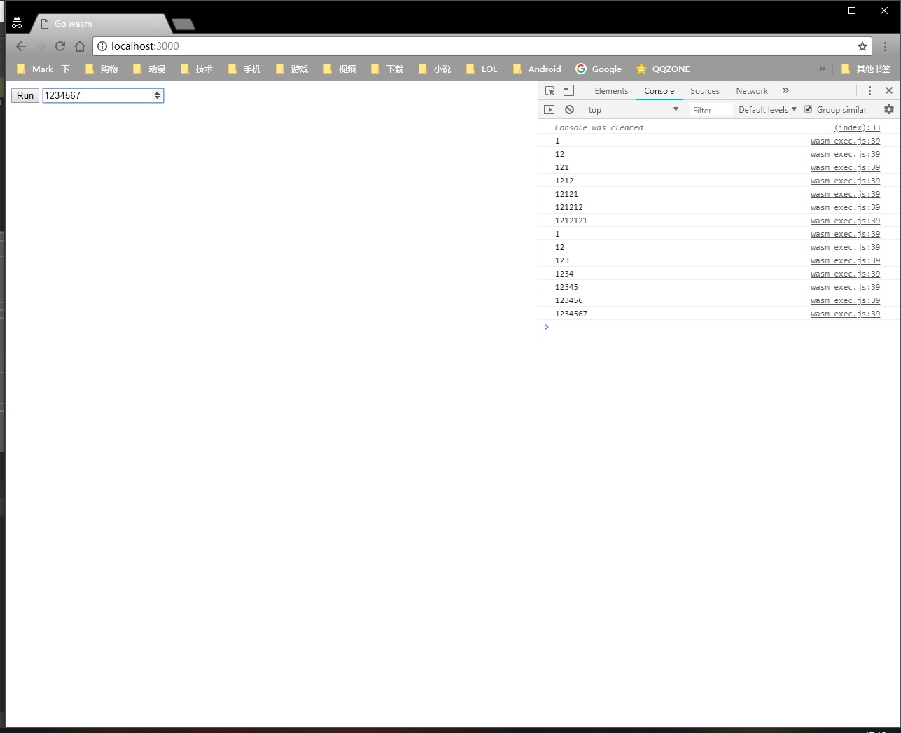

# LearnWasmWithGo
## 控台输出数字

### 1.修改index.html文件，添加一行：
       <input type="number" id="myText" value="" />
### 1.修改main.go文件
    c := make(chan struct{}, 0)

    cb := js.NewCallback(func(args []js.Value) {
        move := js.Global.Get("document").Call("getElementById", "myText").Get("value").Int()
        fmt.Println(move)
    })
    js.Global.Get("document").Call("getElementById", "myText").Call("addEventListener", "input", cb)
    // The goal of the channel is to wait indefinitly
    // Otherwise, the main function ends and the wasm modules stops
    <-c
### 2.编译main.go文件
    go build -o example.wasm main.go
### 3.运行server.go

### 用浏览器打开localhost:3000，并点击run按钮，并在文本框输入数字

